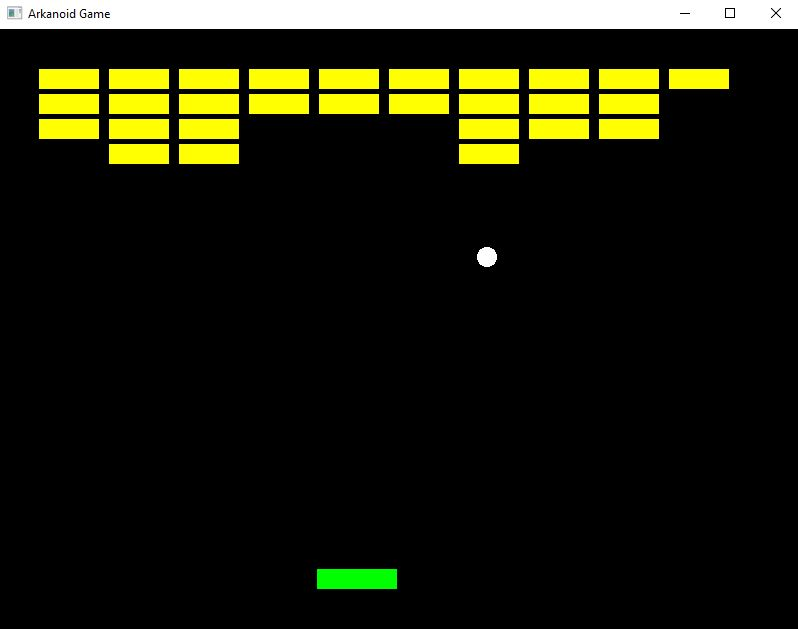

# Arkanoid_Game
I created the game using the SFML library and C ++. I tried to use useful mechanisms from the latest C ++ standards. I will want to extend the application with additional functionalities.

